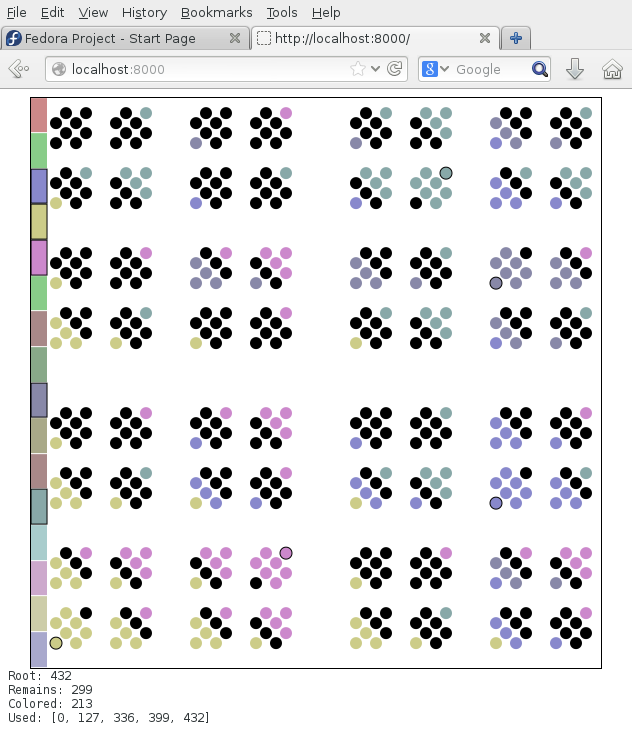

PonderGameAugust2013
====================

Simple browser-based game designed to help solving
[Ponder This August 2013][puzzle] puzzle.
Interactive 9-dimensional cube.

Remark
------

Code for jquery and jquery.svg was added only
so that game will be playable right after clone
and I did not wanted to link remote resources.

[puzzle]: http://domino.research.ibm.com/Comm/wwwr_ponder.nsf/Challenges/August2013.html

